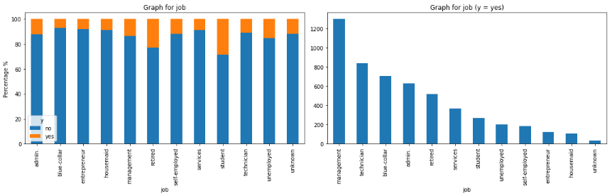
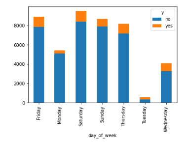
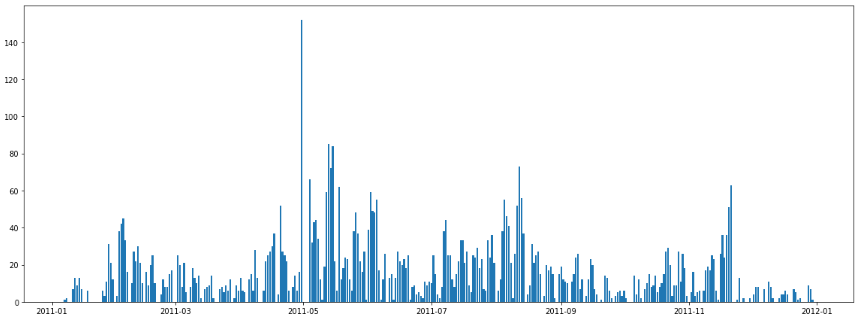

# Bank Marketing Campaign Dataset
## Summary
- Provided descriptive analytics of the Bank Marketing Campaign Dataset provided on the UCI Machine Learning library
- Suggested marketing strategies on how to target campaigns to optimize the number of successful campaigns
- Performed machine learning modeling with some simple tuning to try and accuratley predict the number of successful campaigns

## Code and Resources Used
Python Version: 3.7
Packages: pandas, numpy, matplotlib, seaborn, datetime, sklearn, statsmodels
Dataset: https://archive.ics.uci.edu/dataset/222/bank+marketing

## Data Exploration
### Some Insights
- The dataset is heavily biased towards people with management and blue-collar jobs. But as a percentage, students and retired persons were more likely to agree to a fixed term deposit.

- Campaigns are more likely to be successful if done some time later during the week

- An abnormal number of people signed up for a fixed term deposit on 15/05/2011. Upon further investigation, this was due to news of a recession hitting Portugal 2 days prior leading to a surge of successful campaigns in the coming months.

## Data Preprocessing
- Removed outliers from balance and duration using Q1 < 1.5 * IQR and Q3 > 1.5 * IQR formula
- One-hot encoded catigorical non-ordinal data
- Converted education to numbers ranking 0 to 4
- Replaced -1 in pdays with 0 to indicate missing information

## Data Modelling
- Scaled numerical variables
- Compared different models with tuning to get optimal parameters
- Compared metrics against accuracy, recall, precision, F1 score and training time
-  Used stats model to get summary information of statistically significant fields
-- Upon removing these fields, it didn't seem to have made much of a difference in the accuracy or R-quared values of the model so I let them be.

## Model Performance Summary
1. Logistic Regression
    1. No tuning.
    2. Highest accuracy and precision, low recall and F1 score.
    3. Low training time (~2x higher than the fastest training time which was Decision Trees).

2. Support Vector Classification
    1. No tuning.
    2. Highest accuracy, 2nd highest precision, low recall and F1 score.
    3. Highest training time (~430x higher than the fastest training time).

3. Linear Support Vector Machines
    1. Tuned for max_iter after analyzing accuracy with multiple values.
    2. High accuracy and Precision, fair F1 score, but low recall.
    3. Fair training time (~5x higher than the fastest training time).

4. K Nearest Neighbors
    1. Tuned to n_neighbors = 2 upon analyzing accuracy with multiple values.
    2. High recall and F1 score, lowest accuracy and precision.
    3. High training time (~15x higher than the fastest training time).

5. Decision Trees
    1. Tuned for criterion = entropy after analyzing gini and entropy criterion.
    2. High recall and F1 Score, lowest accuracy and low precision.
    3. Lowest training time.

6. Random Forest
    1. Tuned for n_estimators = 250 after analyzing accuracy with multiple values.
    2. Highest F1 score and high recall, good accuracy, low precision.
    3. High training time (~58x higher than the fastest training time).

## Model Recommendation
- Logistic Regression seems to give the best trade-off accross all variables. This simple model was able to give us high accuracy and precision with the second fastest training time.